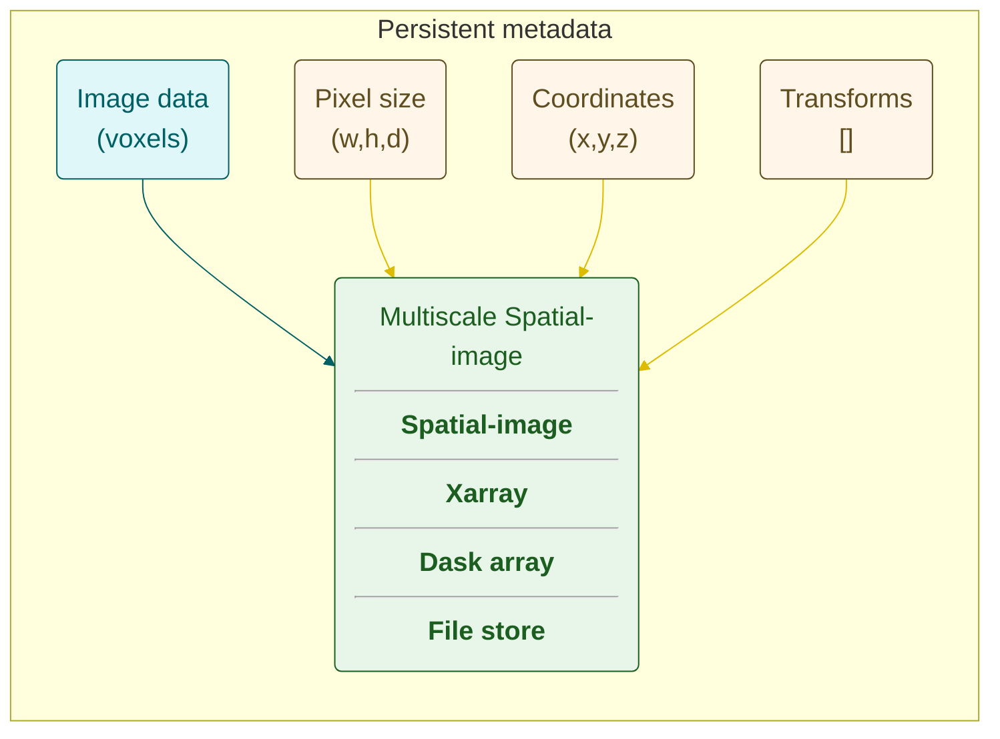

# Next Generation File Format (NGFF)

The commonly used term Next Generation File Format (NGFF) refers to the OME-Zarr file format
which is a Open Microscopy Environment (OME) community-lead format, for storing and sharing large bioimaging datasets.

See the [Comparison of OME-Zarr libs](https://github.com/ome/ome-zarr-py/issues/407) including examples of each of the Python packages.

The textbook [An Introduction to OME-Zarr for Big Bioimaging Data](https://ome-zarr-book.readthedocs.io/) gives a great overview of the NGFF/OME-Zarr format and how to use it in Python.
This is using the ome-zarr-models and pydantic-ome-ngff, as well as the core zarr-python package.

We recommend the use of persistent metadata, together with the image data in [dask](https://docs.dask.org/) format.
The metadata can be persisted in memory by using [Spatial Images](https://github.com/spatial-image/spatial-image)
which are based on [Xarrays](https://docs.xarray.dev/).

## Persistent metadata



The [muvis-align](https://github.com/FrancisCrickInstitute/muvis-align) project [reads OME-Zarr using the ome-zarr-py package](https://github.com/FrancisCrickInstitute/muvis-align/blob/main/muvis_align/image/ZarrDaskSource.py), and writes OME-Zarr through multiview-stitcher,
which in turn also uses the ome-zarr-py package. It uses persistent metadata together with dask arrays for image data as described before.
This metadata is persisted through the OME-Zarr format.

## Basic example reading OME-Zarr

```python
from ome_zarr.io import parse_url
from ome_zarr.reader import Reader

# Example URL of remote data
url = "https://uk1s3.embassy.ebi.ac.uk/idr/zarr/v0.5/idr0062A/6001240_labels.zarr"

# read the image data
reader = Reader(parse_url(url))
# nodes may include images, labels etc
nodes = list(reader())
# first node will be the image pixel data
image_node = nodes[0]

# list of dask arrays at different pyramid levels
data = image_node.data
# dictionary of OME-Zarr metadata
metadata = image_node.metadata

full_size_image_data = data[0]  # access the image data array at full size
axes = "".join([axis["name"] for axis in metadata["axes"]])
```


## Basic example writing OME-Zarr

```python
import zarr
from ome_zarr.writer import write_image

path = "path/to/output_image.zarr"

root = zarr.open_group(store=path)
# supports dask data, by default written out at various pyramid sizes
write_image(image=full_size_image_data, group=root, axes=axes)
```
